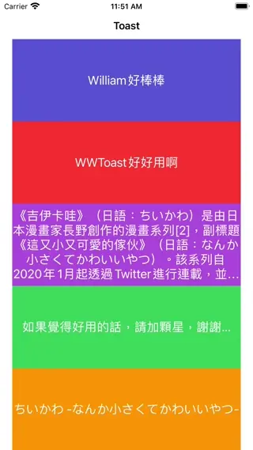

# WWToast

[](https://developer.apple.com/swift/) [](https://developer.apple.com/swift/)  [](https://developer.apple.com/swift/) [](https://developer.apple.com/swift/)

## [Introduction - 簡介](https://swiftpackageindex.com/William-Weng)
- A small tool imitating Android's [Toast](https://developer.android.com/guide/topics/ui/notifiers/toasts) function...
- 一個仿Android的[Toast](https://developer.android.com/guide/topics/ui/notifiers/toasts?hl=zh-tw)功能的小工具…



## [Installation with Swift Package Manager](https://medium.com/彼得潘的-swift-ios-app-開發問題解答集/使用-spm-安裝第三方套件-xcode-11-新功能-2c4ffcf85b4b)

```bash
dependencies: [
    .package(url: "https://github.com/William-Weng/WWToast.git", .upToNextMajor(from: "1.3.0"))
]
```

### [Function - 可用函式](https://www.ithome.com.tw/articles/10293984)
|函式|功能|
|-|-|
|makeText(target:text:)|[顯示文字](https://kotlin.litotom.com/android-zhuan-an-kai-fa/6-activity-she-ji/6.4-shi-yong-fu-dong-xian-shi-toast-lei-bie)|
|makeText(_:targetFrame:)|[顯示文字](https://ithelp.ithome.com.tw/articles/10241214)|
|setting(backgroundViewColor:textColor:toastLength:bottomHeight:animationOptions:)|相關設定|

### WWToastDelegate
|函式|功能|
|-|-|
|toastDisplay(_:textQueue:text:status:)|文字框顯示的狀態|

## Example
```swift
import UIKit
import WWToast

final class ViewController: UIViewController {
    
    @IBOutlet var showToastLabels: [UILabel]!
    
    override func viewDidLoad() {
        super.viewDidLoad()
        initSetting()
    }
    
    @objc func showToast(_ recognizer: UITapGestureRecognizer) {
        
        guard let label = recognizer.view as? UILabel,
              let text = label.text
        else {
            return
        }
        
        WWToast.shared.makeText(text)
    }
}

private extension ViewController {
    
    func initSetting() {
                
        WWToast.shared.setting(backgroundViewColor: .systemPink)
        
        showToastLabels.forEach { label in
            let tapGesture = UITapGestureRecognizer(target: self, action: #selector(Self.showToast(_:)))
            label.addGestureRecognizer(tapGesture)
        }
    }
}
```


