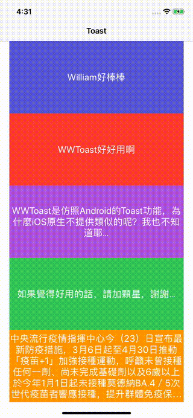

# WWToast

[](https://developer.apple.com/swift/) [](https://developer.apple.com/swift/)  [](https://developer.apple.com/swift/) [](https://developer.apple.com/swift/)

A small tool imitating Android's [Toast](https://developer.android.com/guide/topics/ui/notifiers/toasts) function...

一個仿Android的[Toast](https://developer.android.com/guide/topics/ui/notifiers/toasts?hl=zh-tw)功能的小工具…



### [Installation with Swift Package Manager](https://medium.com/彼得潘的-swift-ios-app-開發問題解答集/使用-spm-安裝第三方套件-xcode-11-新功能-2c4ffcf85b4b)

```
dependencies: [
    .package(url: "https://github.com/William-Weng/WWToast.git", .upToNextMajor(from: "1.0.0"))
]
```

### Example
```swift

import UIKit
import WWPrint
import WWToast

final class ViewController: UIViewController {
    
    @IBOutlet var showToastLabels: [UILabel]!
    
    override func viewDidLoad() {
        super.viewDidLoad()
        initSetting()
    }
    
    @objc func showToast(_ recognizer: UITapGestureRecognizer) {
        
        guard let label = recognizer.view as? UILabel,
              let text = label.text
        else {
            return
        }
        
        WWToast.shared.makeText(target: self, text: text)
    }
}

// MARK: - 小工具
private extension ViewController {
    
    func initSetting() {
        
        showToastLabels.forEach { label in
            let tapGesture = UITapGestureRecognizer(target: self, action: #selector(Self.showToast(_:)))
            label.addGestureRecognizer(tapGesture)
        }
    }
}
```


